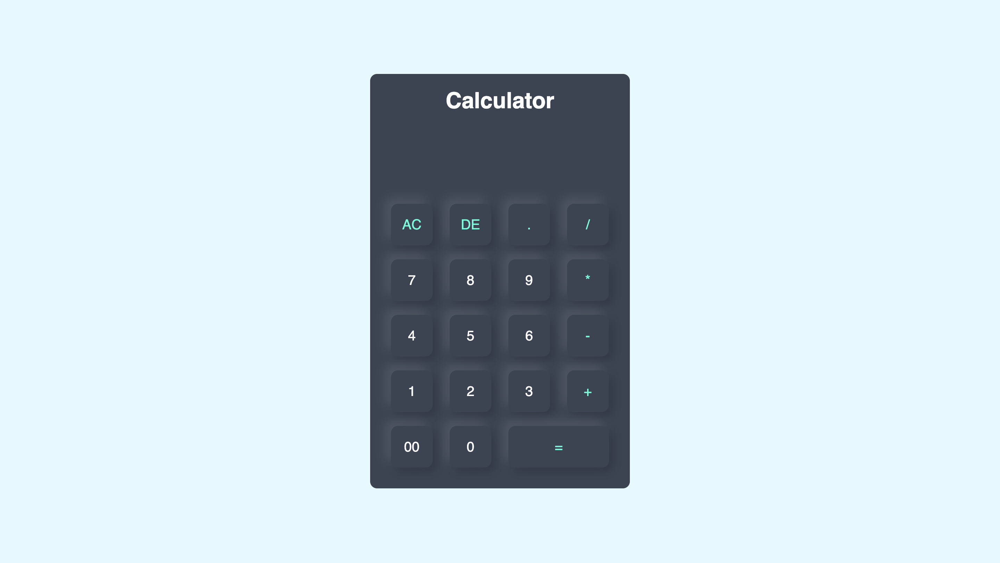

# 🧮 Calculadora Simples

Calculadora Simples Este é um projeto de calculadora desenvolvida com HTML, CSS e JavaScript, como parte dos meus estudos de front-end e práticas em JavaScript.



## ✨ Funcionalidades

- Operações básicas: soma, subtração, multiplicação e divisão
- Interface visual simples e responsiva
- Lógica desenvolvida em JavaScript puro
- Design limpo com CSS

## 💻 Tecnologias utilizadas

- HTML5
- CSS3
- JavaScript

## 📂 Como usar

1. Clone este repositório:
   ```bash
   git clone https://github.com/EduardoAlencarDSA/calculator.git
